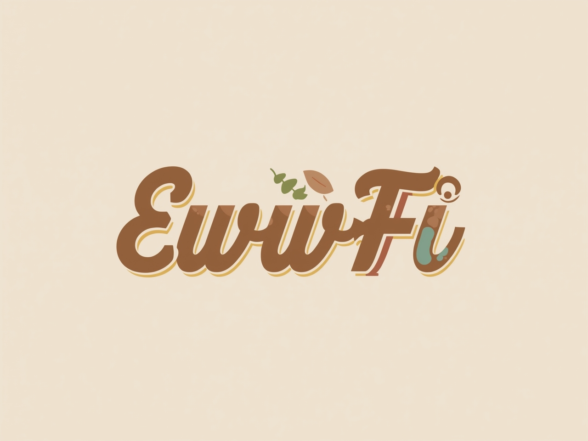

# EwwFi 🌐



**EwwFi** is a sleek, animated Wi-Fi widget built with [Eww](https://github.com/elkowar/eww), styled using the [Catppuccin Mocha](https://github.com/catppuccin/catppuccin) palette. It mimics the functionality of `iwgtk`, offering a minimalist interface for managing Wi-Fi connections via `iwd`.

---

## ✨ Features

- 📡 View available Wi-Fi networks
- 🔐 Connect/disconnect from networks
- 📶 Display current connection status
- 🎨 Catppuccin Mocha-themed UI
- 🧲 Zoom-in animation from screen center
- 🐚 Shell integration with `iwctl`

---

## 📦 Requirements

- `eww`
- `iwd`
- `iwctl`
- `jq`
- `bash`
- GTK-compatible desktop environment

---

## 🚀 Installation

```bash
git clone https://github.com/yourusername/EwwFi.git
cd EwwFi
chmod +x scripts/wifi.sh
eww daemon
eww open wifiWindow
```

___

## 🧠 Architecture

- `scripts/wifi.sh`: Shell backend for fetching and managing Wi-Fi networks
- `.yuck`: Eww widget and window definitions
- `.scss`: Catppuccin Mocha styling
- `wifiWindow`: Centered window with zoom-in animation

___

## 🖌️ Customization

You can tweak:
- Colors in `.scss`
- Animation duration in `.yuck`
- Backend logic in `wifi.sh`

___

## 📸 Preview

___

## 🧑‍💻 Credits

- Inspired by `iwgtk
- Styled with `Catppuccin Mocha`
- Built using `Eww`

___

## LICENSE

MIT

___

## 🤓 Fun Fact

Pronounce it like “eww-fee” — because Wi-Fi should be stylish and a little silly.
